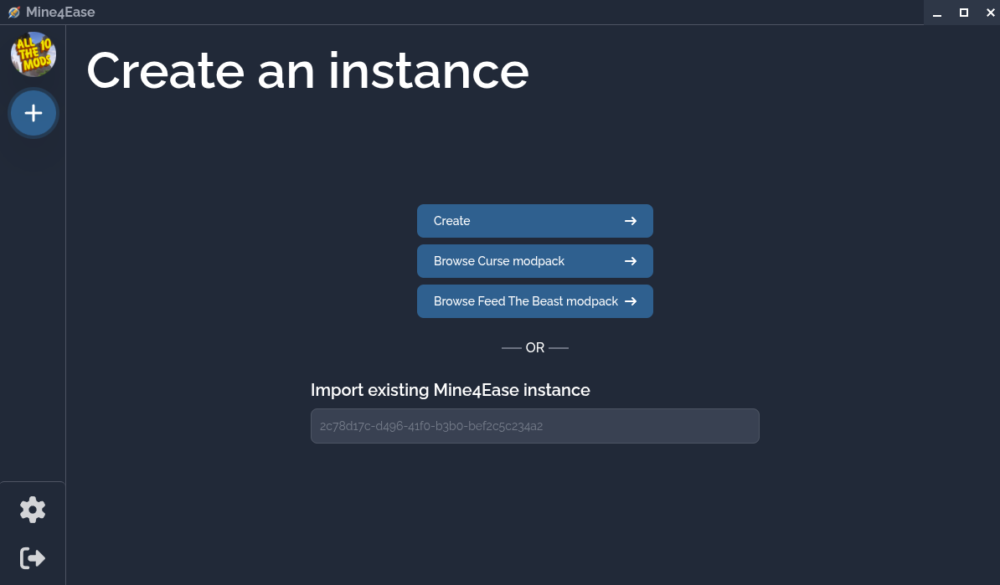
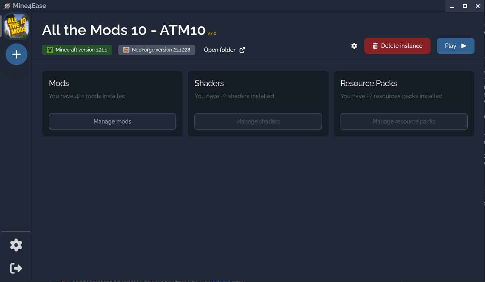

# Mine4Ease

Mine4Ease is a multi-instance Minecraft launcher designed to provide an easy way to manage assets and instances for your game. Built with Vue, Vite, and Electron, it offers a modern and user-friendly interface for Minecraft players.
<br>

| **Create Instance** | **Instance View** |
| :---: | :---: |
|  |  |

### Features

- 📂 **Multi-Instance Management**: Create and manage multiple Minecraft instances independently.
- ⚙️ **Mod Loader Support**: Support for popular mod loaders including Fabric, Forge, NeoForge, and Quilt.
- 📦 **Modpack Integration**: Browse and install modpacks from CurseForge and Feed The Beast (FTB).
- 🛠️ **Mod Management**: Easily search for and manage mods for your instances.
- 🔐 **Easy Authentication**: Simple login process to get you into the game quickly.
- 🗃️ **Asset Management**: Streamlined way to manage your game assets.
- 📝 **Markdown Support**: Integrated markdown renderer for mod and modpack descriptions.

### Installation

🚀 You can download the latest version of Mine4Ease from the [Releases](https://github.com/FezLight/mine4ease/releases) page.

#### 🪟 Windows
1. ⏬ Download the `Mine4Ease-Windows-X.X.X-Setup.exe` file.
2. 🛠️ Run the installer and follow the on-screen instructions.
3. 🎉 Once installed, you can launch Mine4Ease from your desktop or start menu.

#### 🍎 macOS
1. ⏬ Download the `Mine4Ease-Mac-X.X.X-Installer.dmg` file.
2. 📂 Open the `.dmg` file and drag Mine4Ease to your `Applications` folder.
3. 🚀 Launch Mine4Ease from your `Applications` folder.

#### 🐧 Linux

**AppImage**
1. ⏬ Download the `Mine4Ease-Linux-X.X.X.AppImage` file.
2. 🔑 Make the file executable:
   ```bash
   chmod +x Mine4Ease-Linux-X.X.X.AppImage
   ```
3. 🚀 Run the AppImage to launch the application.

**Flatpak (via Flathub)** — _recommended, coming soon_ 🚧

Once published, Mine4Ease will be installable directly from [Flathub](https://flathub.org/) — no manual download, with automatic updates:
```bash
flatpak install flathub io.github.mine4ease
flatpak run io.github.mine4ease
```

**Flatpak (manual bundle)** — _available now_

In the meantime, you can install the bundle from the release page:
1. ⏬ Download the `Mine4Ease-Linux-X.X.X.flatpak` file.
2. 📦 Install it (the required `org.freedesktop.Platform` runtime is pulled from Flathub automatically):
   ```bash
   flatpak install --user Mine4Ease-Linux-X.X.X.flatpak
   ```
3. 🚀 Launch it:
   ```bash
   flatpak run io.github.mine4ease
   ```

### Building from source

Requirements: [Node.js](https://nodejs.org/) 22+ and [Yarn](https://yarnpkg.com/).

```bash
yarn install
yarn build
```

Build output is written to `dist/`.

> 🐧 **Building the Linux Flatpak** additionally requires `flatpak` and `flatpak-builder`, plus the following Flatpak runtimes from [Flathub](https://flathub.org/):
>
> ```bash
> flatpak install --user -y flathub \
> org.freedesktop.Platform//25.08 \
> org.freedesktop.Sdk//25.08 \
> org.freedesktop.Sdk.Extension.node22//25.08 \
> org.electronjs.Electron2.BaseApp//25.08
> ```
>
> These are only needed for the `flatpak` target. The `AppImage` target builds without them.

### Maintainers

- **FezLight** - *Maintener* - [GitHub](https://github.com/FezLight)

### License

This project is licensed under the Apache-2.0 License - see the [LICENSE](LICENSE) file for details.
